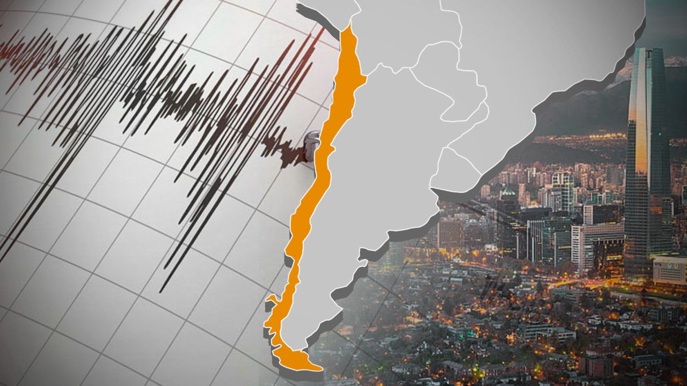

# Análisis de terremoto durante el periodo 1900-2023

---

- [Importación de los Datos](#importación-de-los-datos)

  - [Nomenclatura de los datos](#nomenclatura-de-los-datos)

- [Limpiar y Filtrar los datos mas relevantes](#limpiar-y-filtrar-los-datos-mas-relevantes)

- [Estadisticas y Transformacion de los datos](#estadisticas-y-transformacion-de-los-datos)
- [Conclusión](#conclusión)

---

## Importación de los Datos

El Siguiente proyectos se basa de los datos de los terremotos desde 1900 hasta 2023.

Los Datos lo encontrará [aquí](https://www.kaggle.com/datasets/jahaidulislam/significant-earthquake-dataset-1900-2023 "significant earthquake dataset 1900-2023").

El proyecto de Data Science sobre el análisis de los terremotos tiene como objetivo utilizar técnicas de análisis de datos para estudiar la actividad sísmica en una región geográfica determinada. Para ello, se recopilará un conjunto de datos históricos de terremotos, que incluirá información sobre la fecha, la hora, la ubicación, la magnitud y otros factores relacionados con los terremotos.

Una vez que se ha recopilado y limpiado los datos, se utilizará técnicas de análisis exploratorio de datos para entender la distribución de los terremotos en la región y cómo se relacionan con otros factores como la profundidad, la ubicación geográfica y el tiempo. También se puede utilizar técnicas de visualización de datos para representar gráficamente la información recopilada.

Además, se puede aplicar técnicas de análisis predictivo para predecir la ocurrencia futura de terremotos en la región, lo que puede ayudar a tomar medidas preventivas y de mitigación para reducir los efectos negativos de los terremotos.

Por último, se puede utilizar técnicas de aprendizaje automático para crear modelos que puedan identificar patrones y correlaciones en los datos y utilizarlos para predecir terremotos con mayor precisión. Estos modelos pueden ser útiles para generar alertas tempranas en caso de terremotos inminentes, lo que puede ayudar a minimizar los daños y salvar vidas.

En resumen, el proyecto de análisis de los terremotos utilizará técnicas de análisis de datos y aprendizaje automático para estudiar la actividad sísmica en una región geográfica determinada y predecir la ocurrencia futura de terremotos.

---

### **Nomenclatura de los datos**

La nomenclatura sobre terremotos se refiere a los términos y conceptos utilizados para describir y medir los terremotos. Aquí te presento los términos usado en el datasets:

- **Time:**

La abreviatura **Time 2023-02-17T09:37:34.868Z** se refiere a una marca de tiempo o timestamp en el formato ISO 8601, que es un estándar internacional para representar fechas y horas de forma clara y unificada.
La marca de tiempo **2023-02-17T09:37:34.868Z** se compone de varios elementos:

**2023-02-17** representa la fecha en formato año-mes-día.
**T** es una letra que indica el inicio de la hora.
**09:37:34.868** representa la hora en formato hora:minutos:segundos.milisegundos.
**Z** indica la zona horaria, que en este caso es la hora universal coordinada (UTC).
Por lo tanto, la abreviatura **Time 2023-02-17T09:37:34.868Z** indica un momento específico en el tiempo, que corresponde al 17 de febrero de 2023 a las 09:37:34.868 hora UTC. Este tipo de marca de tiempo es comúnmente utilizado en informes sísmicos, registros de eventos y otras aplicaciones en las que es importante tener un registro preciso del momento en que ocurrieron ciertos sucesos.

- **Place:**

Indica la ubicación de un evento o suceso geográfico específico. En este caso, la abreviatura se refiere a un evento sísmico o terremoto que tuvo lugar a 130 kilómetros al suroeste de Tual, una ciudad ubicada en la provincia de Maluku en Indonesia.

La abreviatura "SW" significa "suroeste", lo que indica la dirección relativa del evento con respecto a la ciudad de Tual. Además, la distancia de 130 km indica la distancia aproximada entre la ciudad de Tual y el lugar del evento sísmico.

Esta abreviatura es común en informes sísmicos y se utiliza para indicar la ubicación de un evento geográfico de manera precisa y concisa. En general, el uso de abreviaturas para indicar la ubicación de un evento se utiliza para ahorrar espacio en el informe y para facilitar la lectura y la comprensión de la información para los expertos y el público en general.

- **Latitude:**

Se refiere a la latitud geográfica de un lugar o evento. La latitud es una coordenada geográfica que se utiliza para medir la ubicación norte-sur de un punto en la superficie terrestre, y se expresa en grados decimales.

En este caso, la abreviatura **Latitude -6.5986** indica que la latitud del lugar o evento es de -6.5986 grados. El signo negativo indica que la ubicación se encuentra en el hemisferio sur, mientras que el valor decimal representa la posición precisa en grados y fracciones de grado.

La latitud es una de las dos coordenadas geográficas principales, junto con la longitud, que se utilizan para determinar la ubicación exacta de un punto en la superficie terrestre. Por lo tanto, la abreviatura "Latitude -6.5986" es una forma común de indicar la ubicación precisa de un evento o lugar en términos de su latitud geográfica.

- **Longitude:**

La abreviatura **Longitude 132.0763** se refiere a la longitud geográfica de un lugar o evento. La longitud es una coordenada geográfica que se utiliza para medir la ubicación este-oeste de un punto en la superficie terrestre, y se expresa en grados decimales.

En este caso, la abreviatura "Longitude 132.0763" indica que la longitud del lugar o evento es de 132.0763 grados. El valor decimal representa la posición precisa en grados y fracciones de grado en dirección este-oeste.

La longitud es una de las dos coordenadas geográficas principales, junto con la latitud, que se utilizan para determinar la ubicación exacta de un punto en la superficie terrestre. Por lo tanto, la abreviatura "Longitude 132.0763" es una forma común de indicar la ubicación precisa de un evento o lugar en términos de su longitud geográfica.

- **Depth:**

La abreviatura **Depth 38.62** se refiere a la profundidad de un evento o suceso geológico en la Tierra. En el contexto de un informe sísmico, esta abreviatura se utiliza para indicar la distancia vertical desde la superficie de la Tierra hasta el lugar donde se produjo el evento sísmico, y se expresa en kilómetros.

En este caso, la abreviatura **Depth 38.62** indica que el evento sísmico o terremoto ocurrió a una profundidad de 38.62 kilómetros bajo la superficie de la Tierra. Esta información es importante porque la profundidad del evento sísmico puede afectar la manera en que se siente el temblor en la superficie, así como la magnitud y el impacto del terremoto.

La profundidad de un evento sísmico también puede proporcionar información sobre la ubicación y las características de las fallas geológicas que causaron el terremoto, y puede ayudar a los científicos a comprender mejor la geología y la dinámica de la Tierra. Por lo tanto, la abreviatura **Depth 38.62** es una forma común de indicar la profundidad de un evento sísmico en informes y registros sísmicos.

- **Mag:**

La abreviatura **Mag 5.61** se refiere a la magnitud de un evento sísmico o terremoto. La magnitud es una medida numérica de la energía liberada por un terremoto en la fuente, y se utiliza para describir la fuerza y el impacto del evento.

En este caso, la abreviatura **Mag 5.61** indica que el terremoto tuvo una magnitud de 5.61 en la escala de Richter o en alguna otra escala de magnitud sísmica. La escala de Richter es la escala de magnitud sísmica más conocida y se utiliza para medir la energía liberada por terremotos pequeños a moderados, mientras que otras escalas de magnitud sísmica, como la escala de magnitud de momento, se utilizan para medir la energía liberada por terremotos más grandes.

La magnitud de un terremoto es una medida importante porque puede ayudar a los científicos y las autoridades a evaluar el peligro y los posibles daños asociados con el evento sísmico. Además, la magnitud puede ser utilizada para comparar la fuerza de terremotos históricos y actuales, lo que ayuda a comprender mejor la actividad sísmica en una región determinada. Por lo tanto, la abreviatura **Mag 5.61** es una forma común de indicar la magnitud de un evento sísmico en informes y registros sísmicos.

- **Mag type:**

La abreviatura **Mag type mw** se refiere al tipo de magnitud utilizada para medir la energía liberada por un terremoto en la escala de magnitud de momento (moment magnitude scale en inglés). La escala de magnitud de momento (MW) es una escala de magnitud sísmica que mide la energía total liberada por un terremoto en la fuente, basándose en la amplitud de las ondas sísmicas registradas por los sismómetros.

La magnitud de momento es una medida más precisa de la energía liberada por un terremoto que la escala de Richter y se utiliza principalmente para medir terremotos de magnitud moderada a grande. La magnitud de momento es especialmente útil para medir la energía liberada por terremotos que ocurren debajo del fondo del mar, ya que estos terremotos no se registran tan bien en la superficie de la Tierra.

Por lo tanto, la abreviatura **Mag type mw** indica que la magnitud del terremoto ha sido medida en la escala de magnitud de momento (MW). Es importante señalar que existen otras escalas de magnitud sísmica, como la escala de Richter o la escala de magnitud de onda superficial (MS), pero la escala de magnitud de momento (MW) es la más precisa y se utiliza con mayor frecuencia en la actualidad.

- **Nst:**

La abreviatura **Nst 506** se refiere al número de estaciones que se utilizaron para determinar la ubicación y los parámetros del terremoto, como la magnitud y la profundidad.

**Nst** es la abreviatura de "Número de Estaciones" (Number of Stations en inglés), que se refiere al número de estaciones sísmicas que se utilizaron para medir el terremoto. En este caso, se utilizaron 506 estaciones para determinar los parámetros del terremoto.

El uso de un gran número de estaciones sísmicas permite una mejor localización del terremoto y una mayor precisión en la determinación de su magnitud y otros parámetros sísmicos. La ubicación precisa del terremoto y la estimación precisa de su magnitud y profundidad son importantes para la evaluación de los peligros y riesgos sísmicos en la región afectada y para la respuesta de emergencia en caso de daños y afectaciones.

- **Gap:**

La abreviatura **Gap 15** se refiere al "ángulo de brecha" (Gap angle en inglés) en grados, que es una medida de la calidad y la distribución espacial de las estaciones sísmicas utilizadas para la localización de un terremoto.

El ángulo de brecha se define como el espacio angular entre las estaciones sísmicas adyacentes en la red de estaciones sísmicas que se utilizan para la localización de un terremoto. Cuanto menor sea el ángulo de brecha, más densamente distribuidas están las estaciones y, por lo tanto, mayor será la precisión en la localización del terremoto.

En el caso de **Gap 15**, la brecha angular entre las estaciones sísmicas adyacentes en la red utilizada para la localización del terremoto es de 15 grados. Esto sugiere que las estaciones sísmicas están relativamente bien distribuidas y que la localización del terremoto puede ser bastante precisa. Es importante tener en cuenta que cuanto menor sea la brecha angular, mayor será la precisión en la localización del terremoto.

El ángulo de brecha es una medida importante de la calidad de la red de estaciones sísmicas utilizadas para la localización de terremotos. Una brecha angular grande puede afectar negativamente la precisión en la localización del terremoto y, por lo tanto, la evaluación del riesgo sísmico en la región afectada.

- **Dmin:**

La abreviatura **Dmin 7.99** se refiere a la distancia epicentral mínima (Minimum Epicentral Distance en inglés) entre la ubicación del terremoto y la estación sísmica más cercana, medida en grados. La distancia epicentral mínima es una medida importante de la precisión en la localización del terremoto y su cálculo es utilizado por los sismólogos para evaluar la calidad de la red de estaciones sísmicas utilizadas en la localización.

En este caso, **Dmin 7.99** indica que la estación sísmica más cercana al epicentro del terremoto estaba a una distancia de 7.99 grados. Cuanto menor sea la distancia epicentral mínima, mayor será la precisión en la localización del terremoto y menor será la incertidumbre asociada a la estimación de su magnitud y otros parámetros sísmicos.

La distancia epicentral mínima es una medida importante para evaluar la calidad de la localización del terremoto. Si la distancia epicentral mínima es grande, la localización del terremoto puede ser menos precisa y puede haber una mayor incertidumbre en la determinación de sus parámetros sísmicos. Por lo tanto, es importante contar con una red de estaciones sísmicas densamente distribuidas para lograr una localización precisa del terremoto y una mejor evaluación del riesgo sísmico en la región afectada.

- **Rms:**

La abreviatura **Rms 0.42** se refiere al Error Cuadrático Medio (Root Mean Square Error en inglés) en la localización del terremoto. El error cuadrático medio es una medida de la precisión en la localización del terremoto y se calcula a partir de la diferencia entre las coordenadas hipocentrales estimadas y las observadas en las estaciones sísmicas.

En este caso, **Rms 0.42** indica que el error cuadrático medio en la localización del terremoto es de 0.42 segundos para el tiempo de arribo y una distancia epicentral de 1 kilómetro. Cuanto menor sea el valor de error cuadrático medio, mayor será la precisión en la localización del terremoto.

El error cuadrático medio es una medida importante para evaluar la precisión en la localización del terremoto y se utiliza para estimar la incertidumbre asociada a los parámetros sísmicos, como la magnitud y la profundidad. Una precisión mayor en la localización del terremoto reduce la incertidumbre en la estimación de estos parámetros y ayuda a los sismólogos y otros expertos en riesgo sísmico a comprender mejor el comportamiento sísmico de la región afectada y, en consecuencia, tomar medidas para reducir el riesgo sísmico.

- **Net:**

La abreviatura **Net ISC-GEM** se refiere a la red sísmica o el sistema utilizado para la detección, registro y procesamiento de datos sísmicos del terremoto. En este caso, **Net** significa "Network" o "Red" en inglés, mientras que **ISC-GEM** se refiere a la organización y base de datos ISC-GEM (International Seismological Centre - Global Earthquake Model), una organización que recopila, archiva y distribuye datos sísmicos a nivel mundial.

ISC-GEM es una base de datos que contiene información detallada de terremotos históricos y recientes en todo el mundo, proporcionando información importante sobre la localización, magnitud, profundidad y otros parámetros sísmicos. ISC-GEM recopila datos de una variedad de redes sísmicas en todo el mundo y utiliza un enfoque global para compilar y verificar la información sísmica, lo que permite una mejor comprensión de la actividad sísmica a nivel mundial.

En resumen, **Net ISC-GEM** indica que los datos del terremoto se obtuvieron de la red sísmica de la base de datos ISC-GEM, lo que sugiere que los datos son precisos y de alta calidad y están disponibles para su uso en estudios científicos y de riesgo sísmico.

- **ID:**

La abreviatura **ID ISCGEM913898** se refiere a un número de identificación único asignado por el ISC-GEM (Centro Sismológico Internacional - Modelo Global de Terremotos) a un terremoto específico.

ISC-GEM es una organización que recopila, archiva y distribuye datos sísmicos a nivel mundial, y utiliza un sistema de identificación numérica único para cada evento sísmico registrado. El número de identificación único se utiliza para distinguir y hacer referencia a eventos sísmicos específicos en la base de datos de ISC-GEM y en otros estudios y publicaciones relacionados con la actividad sísmica.

En resumen, **ID ISCGEM913898** indica que el terremoto al que se hace referencia en los datos tiene un número de identificación único en la base de datos de ISC-GEM, lo que permite una fácil identificación y referencia a este evento sísmico específico en estudios y análisis posteriores.

- **Updated:**

La abreviatura **Updated 2023-02-17T17:58:24.040Z** se refiere a la última vez que se actualizó la información del terremoto.

El término **Updated** indica que se ha actualizado la información anterior del terremoto con nueva información. La fecha y hora **2023-02-17T17:58:24.040Z** indican la fecha y hora exactas en que se realizó la actualización.

La **Z** al final de la fecha y hora representa la zona horaria UTC (Tiempo Universal Coordinado), lo que significa que se está utilizando la hora estándar internacional en la que se basa la mayoría de los sistemas de navegación y tiempo.

En resumen, **Updated 2023-02-17T17:58:24.040Z** indica que la información del terremoto ha sido actualizada por última vez el 17 de febrero de 2023 a las 17:58:24 UTC.

- **Type:**

Sin embargo, la palabra **type** se puede utilizar para referirse al tipo de terremoto que se ha registrado. Los diferentes tipos de terremotos incluyen terremotos tectónicos, terremotos volcánicos, terremotos de deslizamiento, entre otros.

Por lo tanto, es posible que la abreviatura **type earthquake** se utilice en combinación con otra información para describir el tipo de terremoto que se ha registrado. Por ejemplo, **Mag Type MW** podría indicar el tipo de magnitud del terremoto, mientras que **Depth Type Earthquake** podría indicar el tipo de terremoto en función de la profundidad del foco.

- **Horizontal Error:**

La abreviatura **Horizontal Error 4.7** se refiere al error horizontal estimado en la ubicación del epicentro del terremoto.

El error horizontal es una medida de la incertidumbre en la ubicación horizontal del epicentro de un terremoto, que se determina a partir de las mediciones sísmicas. En este caso, el valor numérico de **4.7** indica la magnitud del error estimado en kilómetros.

En resumen, **Horizontal Error 4.7** indica que se estima que el error horizontal en la ubicación del epicentro del terremoto es de aproximadamente 4.7 km. Es importante tener en cuenta que esta estimación puede estar sujeta a revisión a medida que se recopila más información y se realizan más análisis.

- **Depth Error:**

La abreviatura **Depth Error 9.2** se refiere al error estimado en la profundidad del foco del terremoto.

El error de profundidad se refiere a la incertidumbre en la profundidad del foco del terremoto, que puede ser difícil de medir con precisión. En este caso, el valor numérico de **9.2** indica la magnitud del error estimado en kilómetros.

En resumen, **Depth Error 9.2** indica que se estima que el error en la medición de la profundidad del foco del terremoto es de aproximadamente 9.2 km. Es importante tener en cuenta que esta estimación puede estar sujeta a revisión a medida que se recopila más información y se realizan más análisis.

- **Mag Error:**

La abreviatura **Mag Error 0.2** se refiere al error estimado en la magnitud del terremoto.

El error de magnitud se refiere a la incertidumbre en la medición de la magnitud del terremoto, que puede ser difícil de medir con precisión. En este caso, el valor numérico de "0.2" indica la magnitud del error estimado en unidades de magnitud de momento (Mw).

En resumen, **Mag Error 0.2** indica que se estima que el error en la medición de la magnitud del terremoto es de aproximadamente 0.2 unidades de magnitud de momento. Es importante tener en cuenta que esta estimación puede estar sujeta a revisión a medida que se recopila más información y se realizan más análisis.

- **Mag Nst:**

La abreviatura **Mag Nst 47** se refiere al número de estaciones sísmicas que se utilizaron para calcular la magnitud del terremoto.

La sigla **Mag** indica que se trata de la magnitud del terremoto, mientras que "Nst" indica el número de estaciones sísmicas utilizadas para calcular la magnitud. En este caso, **47** indica que se utilizaron 47 estaciones sísmicas para calcular la magnitud del terremoto.

En general, cuanto mayor sea el número de estaciones sísmicas utilizadas para calcular la magnitud de un terremoto, mayor será la precisión de la medida de la magnitud. Sin embargo, el número de estaciones sísmicas disponibles para un terremoto particular puede variar y afectar la precisión de la medida de la magnitud.

- **Status:**

La abreviatura **Status reviewed** indica que el informe del terremoto ha sido revisado por un sismólogo o un analista sísmico para verificar su precisión y confiabilidad.

En algunos casos, los informes iniciales de terremotos pueden ser automatizados o generados por algoritmos, y pueden requerir una revisión manual para confirmar que la información es precisa. Cuando se indica **Status reviewed**, se entiende que se ha llevado a cabo un proceso de revisión para garantizar que los detalles del terremoto sean precisos y fiables.

En resumen, **Status reviewed** significa que el informe del terremoto ha sido revisado y confirmado por un sismólogo o un analista sísmico.

- **Location Source:**

La abreviatura "Location Source iscgem" se refiere a la fuente de información utilizada para determinar la ubicación del terremoto. En este caso, "iscgem" significa "International Seismological Centre Global Earthquake Model".

El International Seismological Centre (ISC) es una organización sin fines de lucro que recopila y archiva datos sísmicos de todo el mundo. El Global Earthquake Model (GEM) es una iniciativa global para desarrollar herramientas y recursos que ayuden a comprender y gestionar el riesgo sísmico.

En resumen, **Location Source iscgem** significa que la ubicación del terremoto ha sido determinada utilizando datos recopilados y archivados por el International Seismological Centre y su Global Earthquake Model.

- **Mag Source:**

La abreviatura **Mag Source official** se refiere a la fuente oficial de información utilizada para determinar la magnitud del terremoto. En este caso, **official** significa que la magnitud ha sido determinada por una fuente autorizada y reconocida.

La magnitud de un terremoto se mide utilizando diferentes escalas, como la escala de Richter, la escala de magnitud de momento (Mw), la escala de magnitud de onda superficial (Ms), entre otras. La magnitud se determina a partir de mediciones de las ondas sísmicas generadas por el terremoto.

En resumen, **Mag Source official** significa que la magnitud del terremoto ha sido determinada por una fuente oficial y reconocida, utilizando una de las escalas de magnitud sísmica estándar.

[🔼](#análisis-de-terremoto-durante-el-periodo-1900-2023)

---

## Limpiar y Filtrar los datos mas relevantes

- **Eliminar valores duplicados:**

Los datos duplicados pueden introducir errores en el análisis y deben eliminarse.

- **Revisar valores faltantes:**

Si hay valores faltantes, debe determinarse si es posible imputarlos o si deben eliminarse las filas correspondientes.

- **Verificar la consistencia de los datos:**

Los valores extremos o inesperados pueden ser señal de errores en la recolección de datos y deben verificarse y, si es necesario, corregirse.

- **Verificar la calidad de los datos:**

Los datos incompletos, inconsistentes o incorrectos pueden ser una señal de problemas en la calidad de los datos y deben ser corregidos.

- **Normalizar los datos:**

Los valores de los datos pueden estar en diferentes escalas o unidades, lo que puede dificultar la comparación entre ellos. Es posible que deba normalizar los datos para facilitar el análisis.

- **Verificar la precisión de los datos:**

los errores de entrada de datos pueden introducir errores en el análisis. Por lo tanto, debe verificar que los datos se ingresaron correctamente y hacer correcciones si es necesario.

- **Estandarizar los datos:**

Los nombres de columnas o variables pueden variar en diferentes conjuntos de datos. Para facilitar el análisis, es posible que deba estandarizar los nombres de las variables.

[🔼](#análisis-de-terremoto-durante-el-periodo-1900-2023)

---

## **Estadisticas y Transformacion de los datos**

- **Histograma de magnitudes:**

Este gráfico muestra la distribución de las magnitudes de los terremotos en el DataFrame. Puede ayudar a visualizar la frecuencia terremotos se han producido en cada rango de magnitud.

- **Gráfico de dispersión de profundidad y magnitud:**

Este gráfico muestra la relación entre la profundidad y la magnitud de los terremotos en el DataFrame. Puede ayudar a identificar patrones y tendencias en los datos.

- **Mapa de calor de ubicaciones:**

Este gráfico muestra la ubicación geográfica de los terremotos en el DataFrame utilizando un mapa de calor. Los colores más oscuros indican una mayor concentración de terremotos en una ubicación particular.

- **Gráfico de serie temporal:**

Este gráfico muestra la frecuencia de los terremotos a lo largo del tiempo. Puede ayudar a identificar patrones estacionales o cambios a lo largo del tiempo.

- **Gráfico de cajas y bigotes:**

Este gráfico muestra la distribución de los valores de una variable, como la magnitud del terremoto, y también puede mostrar valores atípicos. Puede ayudar a visualizar la variabilidad de los datos y la presencia de valores extremos.

- **Gráfico de densidad de frecuencia:**

Este gráfico muestra la distribución de frecuencia de los terremotos a lo largo de una escala de magnitud continua. Puede ayudar a visualizar la densidad de eventos sísmicos en diferentes rangos de magnitud.

- **Gráfico de probabilidad acumulada:**

Este gráfico muestra la probabilidad acumulada de que un terremoto tenga una magnitud específica. Puede ayudar a evaluar el riesgo de terremotos de gran magnitud en una región específica.

- **Gráfico de barras:**

Un gráfico de barras podría utilizarse para mostrar la cantidad de terremotos en cada continente o país. Esto podría ayudar a identificar las regiones con mayor actividad sísmica.

[🔼](#análisis-de-terremoto-durante-el-periodo-1900-2023)

---

## **Conclusión**

- **Histograma de magnitudes:**

Podemos concluir que la mayoría de los terremotos en el DataFrame tienen una magnitud entre 7 y 8, y que hay muy pocos terremotos con magnitudes superiores a 8. La etiqueta con la frecuencia máxima en cada barra nos permite identificar fácilmente el rango de magnitud con mayor cantidad de terremotos. Además, la línea vertical en la media de la distribución nos muestra que la magnitud promedio de los terremotos es de alrededor de 7.8.

- **Gráfico de dispersión de profundidad y magnitud:**

Esta gráfica muestra la relación entre la profundidad y la magnitud de los terremotos. Se puede observar que la mayoría de los terremotos se producen en profundidades menores a 100 km y con magnitudes menores a 7. Además, se puede apreciar una tendencia a que los terremotos más profundos tienden a tener una magnitud mayor. También se puede observar que los terremotos más intensos (representados por círculos más grandes y colores más oscuros) se encuentran en una franja estrecha de profundidades entre 10 km y 50 km. En general, esta gráfica muestra cómo la profundidad y la magnitud están relacionadas en los terremotos, lo que puede ser útil para entender mejor cómo se producen los terremotos y cómo pueden afectar a las zonas afectadas.

- **Mapa de calor de ubicaciones:**

Este código genera un mapa interactivo utilizando la biblioteca folium de Python. El mapa muestra la ubicación de los terremotos en el conjunto de datos y utiliza un mapa de calor para representar la frecuencia y la intensidad de los terremotos. También se muestra un marcador para los 20 terremotos más fuertes del conjunto de datos, que incluyen información sobre la magnitud, la profundidad y la fecha del terremoto.

Las conclusiones que se pueden obtener de este mapa son:

- Los terremotos ocurren en todo el mundo, aunque hay ciertas regiones donde son más frecuentes, como la región del Pacífico (conocida como el "Anillo de Fuego").
- Los terremotos más intensos suelen ocurrir en regiones donde las placas tectónicas se están moviendo activamente, como en la costa oeste de América del Sur y América Central, Japón y Nueva Zelanda.
- Los terremotos más fuertes pueden tener un impacto devastador en la población y la infraestructura cercanas, especialmente si ocurren en zonas densamente pobladas o en regiones con edificios y estructuras vulnerables.

* **Gráfico de serie temporal:**

El gráfico de serie temporal muestra la cantidad de terremotos registrados por año en el conjunto de datos. Se puede observar que la cantidad de terremotos registrados ha aumentado con el tiempo, con un pico en los años 2010 y 2011. También se puede ver que hay una gran variabilidad en la cantidad de terremotos registrados de un año a otro. En general, este gráfico sugiere que la actividad sísmica ha aumentado con el tiempo y que puede ser importante monitorear y estudiar esta tendencia.

- **Gráfico de cajas y bigotes:**

En el gráfico de cajas y bigotes podemos observar la distribución de la magnitud de los terremotos. La caja representa el rango intercuartílico, es decir, el 50% de los terremotos se encuentran en este rango. La línea en el medio de la caja representa la mediana. Los bigotes representan el rango completo de los datos, excluyendo los valores atípicos (outliers). Los valores atípicos se representan como puntos individuales por encima o por debajo de los bigotes.

En este gráfico podemos ver que la mediana de la magnitud de los terremotos se encuentra alrededor de 4.8 y que el rango intercuartílico va desde aproximadamente 4 a 5.5. También podemos ver que hay varios valores atípicos en el extremo superior, lo que indica que hay algunos terremotos muy grandes en la muestra.

- **Gráfico de densidad de frecuencia:**

Esta gráfica representa la densidad de frecuencia de las magnitudes de los terremotos. La curva roja representa la distribución de las magnitudes, mientras que las líneas verticales indican la media y la mediana.

Podemos observar que la mayoría de los terremotos en el conjunto de datos tienen una magnitud alrededor de 8.0. Además, podemos notar que la distribución es asimétrica hacia la derecha, lo que significa que hay más terremotos con magnitudes más altas que con magnitudes más bajas.

La media (línea verde) y la mediana (línea azul) están relativamente cerca una de la otra, lo que sugiere que la distribución no está muy sesgada. En general, esta gráfica nos permite visualizar la distribución de las magnitudes de los terremotos y obtener una idea de la forma en que se distribuyen los datos.

- **Gráfico de probabilidad acumulada:**

La gráfica muestra la probabilidad acumulada de las magnitudes de los terremotos en el conjunto de datos analizado. Se puede observar que la mayoría de los terremotos tienen una magnitud entre 7.0 y 8.5 en la escala de Richter, y que la probabilidad acumulada disminuye a medida que aumenta la magnitud del terremoto. También se puede observar que hay una pequeña disminución en la probabilidad acumulada alrededor de 8.0 en la escala de Richter, lo que puede indicar que los terremotos de esta magnitud son menos comunes que los terremotos de magnitudes ligeramente más bajas o más altas.

- **Gráfico de barras:**

Este gráfico de barras muestra la cantidad de terremotos por región del mundo. Las barras representan el número de terremotos en cada región y están coloreadas para distinguir entre las regiones.

Se puede ver que la región con la mayor cantidad de terremotos es Asia, seguida de América del Sur y América Central. También se puede notar que Oceanía tiene la menor cantidad de terremotos en comparación con las otras regiones.

En general, este gráfico muestra una buena representación visual de la distribución de terremotos en diferentes regiones del mundo.

[🔼](#análisis-de-terremoto-durante-el-periodo-1900-2023)

---
